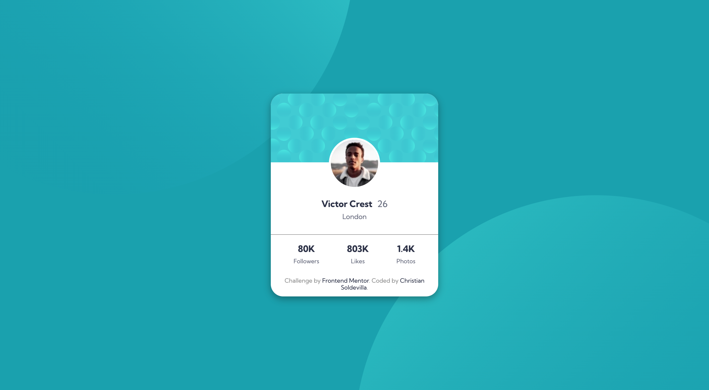
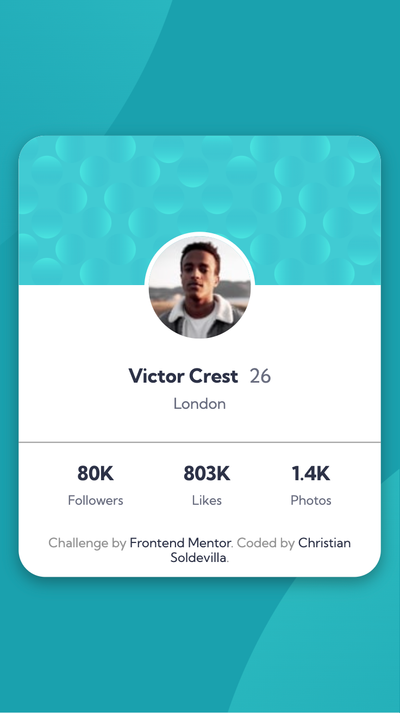

# Frontend Mentor - Profile card component solution

This is a solution to the [Profile card component challenge on Frontend Mentor](https://www.frontendmentor.io/challenges/profile-card-component-cfArpWshJ). Frontend Mentor challenges help you improve your coding skills by building realistic projects. 

## Table of contents

- [Overview](#overview)
  - [The challenge](#the-challenge)
  - [Screenshot](#screenshot)
  - [Links](#links)
- [My process](#my-process)
  - [Built with](#built-with)
  - [What I learned](#what-i-learned)
- [Author](#author)

## Overview

### The challenge

- Build out the project to the designs provided

### Screenshot




### Links

- Solution URL: [github.com/soldochris/Profile-card](https://github.com/soldochris/Profile-card)
- Live Site URL: [soldochris.github.io/Profile-card](https://soldochris.github.io/Profile-card/)

## My process

### Built with

- Semantic HTML5 markup
- CSS custom properties
- Flexbox
- Mobile-first workflow

### What I learned

I learned how to position two background images in specific places:

```css
body {
  height: 100vh;
  width: 100vw;
  background-image: url(./images/bg-pattern-top.svg), url(./images/bg-pattern-bottom.svg);
  background-position: right 50vw bottom 50vh, left 50vw top 50vh;
  background-repeat: no-repeat, no-repeat;
  background-size: auto, auto;
}
```

## Author

- Website - [christiansoldevilla.tech](https://christiansoldevilla.tech/?i=1)
- Frontend Mentor - [@soldochris](https://www.frontendmentor.io/profile/soldochris)
- LinkedIn - [/christian-soldevilla](https://www.linkedin.com/in/christian-soldevilla/)